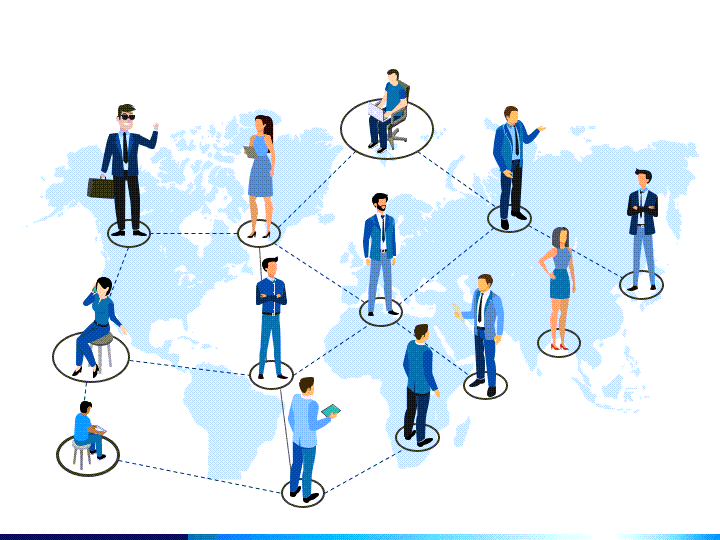

# Problem Overview 

There are several considerable gaps in our understanding of communication techniques for distributed teams. One significant gap is the incorporation of developing technology into remote team communication methods. With technological breakthroughs such as augmented reality, virtual reality, and artificial intelligence, it is critical to investigate how these technologies might be applied to enhance communication, collaboration, and knowledge sharing among remote and distributed teams.

Furthermore, a deeper investigation of practises that promote successful communication across diverse and geographically dispersed teams will improve the research. Research on the complexities of cross-cultural communication, language barriers, and virtual collaboration issues can give useful insights for building diversity, understanding, and effective communication practises within remote and distributed teams.

By identifying these gaps in the literature, this thesis aims to contribute to the field by proposing efficient communication tactics for remote and dispersed teams. Bridging these gaps will assist organisations and individuals in navigating the complexity of remote work, focusing on the possibilities it provides, and promoting collaboration, productivity, and success in these constantly evolving work settings.

